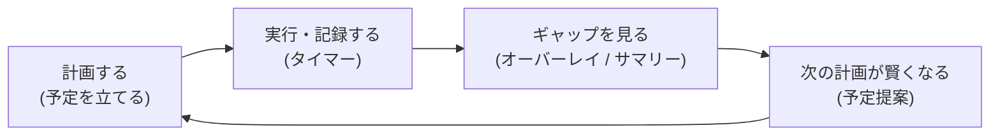
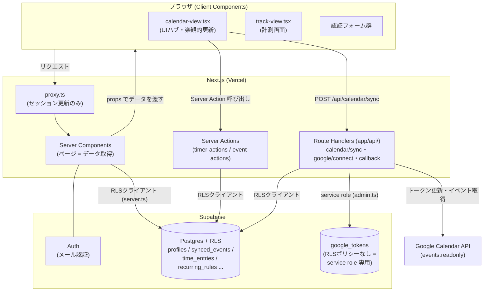
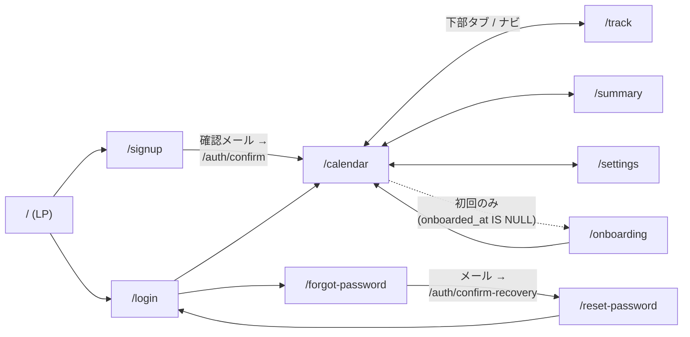
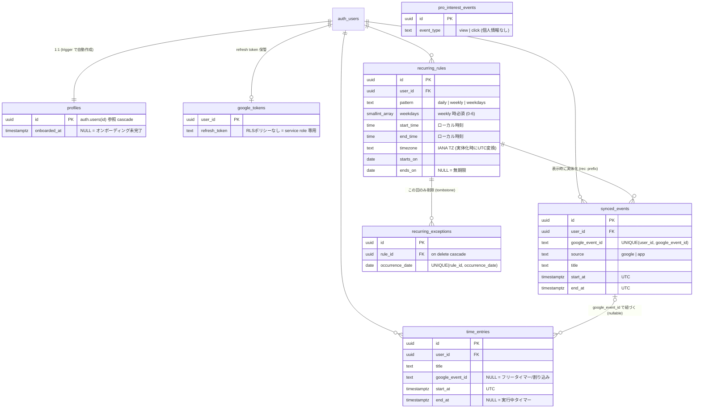
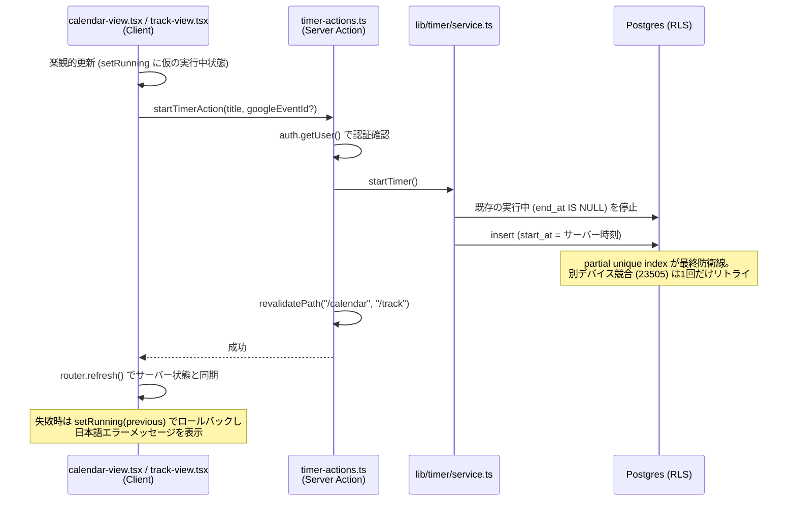
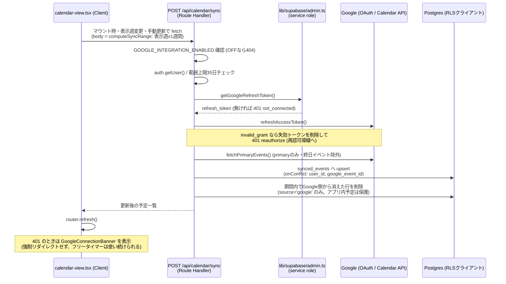
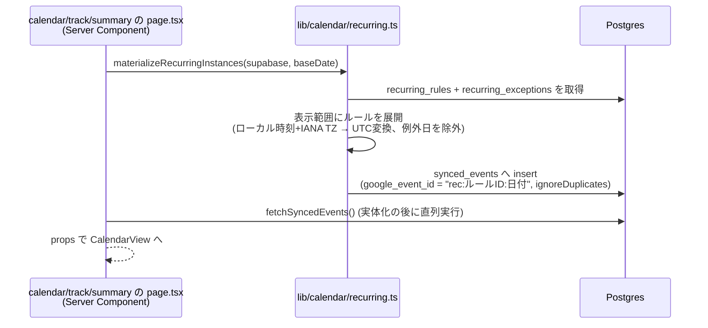
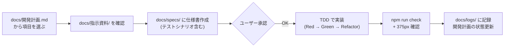

# PlanDiff アーキテクチャ解説

初めてこのプロジェクトを開発する人向けの資料。プロダクトの目的、システム構成、データモデル、主要なデータフロー、開発の進め方を1つにまとめている。詳細仕様は `docs/要件定義書.md` と `docs/specs/` の各仕様書を、開発ルールは `CLAUDE.md` を正とする。

---

## 1. プロダクト概要

**PlanDiff は「見積もりが当たるようになる、エンジニアのためのカレンダー × タイムトラッカー」**。

カレンダーの「予定(計画)」と、ワンタップで記録する「実績(現実)」を**同一タイムラインに重ねて表示**し、計画と現実のギャップを可視化する。ターゲットはソフトウェアエンジニア個人。差別化の核は「予定 × 実績のオーバーレイ表示」と「見積もりズレの定量化」であり、機能の広さでは戦わない。

### コアループ



### 重要な前提: Google連携は現在「凍結中」

もともとGoogleカレンダー連携を主導線として設計されたが、ドメイン取得・OAuth審査のリードタイムが開発ボトルネックになったため、2段階の方針転換を行った(経緯は要件定義書 §変更履歴、仕様書 P1-3 / P2-5):

1. **メール認証(Supabase Auth)を主導線化** — Googleログインは提供しない
2. **Google連携UIを環境フラグ `GOOGLE_INTEGRATION_ENABLED`(既定OFF)で凍結** — 予定はアプリ内作成で完結

Google連携のコード・テストは削除されておらず、フラグをONにすれば復活する。**現在の主導線は「メール認証 + アプリ内予定 + タイマー」**である。この資料でもGoogle連携のフローを解説するが、動作させるにはフラグONが必要。

---

## 2. 技術スタック

| レイヤー | 技術 | 補足 |
|---|---|---|
| フレームワーク | Next.js 16(App Router)+ React 19 + TypeScript strict | **Next.js 16 では middleware が `proxy.ts` に改名されている**。API差分は `node_modules/next/dist/docs/` を参照(`AGENTS.md` 参照) |
| 認証・DB | Supabase(Auth / Postgres / RLS) | `@supabase/ssr` + `@supabase/supabase-js` |
| スタイリング | Tailwind CSS v4 | デザイントークンを `@theme` で一元管理。raw color 禁止(静的テストで強制) |
| 日時処理 | date-fns 4 + `@date-fns/tz` | `Date` の直接演算は避ける。DB保存は常にUTC |
| 外部API | Google Calendar API | `calendar.events.readonly` のみ。**writeスコープ禁止** |
| ホスティング | Vercel | 本番: https://plandiff.vercel.app |
| テスト | Vitest 4 + Testing Library | unit/component(jsdom)と integration(ローカルSupabase)の2層 |
| 配布 | PWA | manifest + アイコンのみ。Service Worker / プッシュ通知はスコープ外 |

---

## 3. 全体アーキテクチャ



### 3つのSupabaseクライアント(`lib/supabase/`)

| ファイル | 用途 | 権限 |
|---|---|---|
| `server.ts` | Server Component / Server Action / Route Handler | ログインユーザーの権限(**RLSが効く**)。cookieからセッションを読む |
| `browser.ts` | Client Component | 同上(anonキー) |
| `admin.ts` | サーバー専用の特権処理 | **service role(RLSを迂回)**。`google_tokens` の読み書き、アカウント削除、pro-interest計測に限定。冒頭の `import "server-only"` により、誤ってクライアントバンドルに混入するとビルドエラーになる |

### 責務の分離原則

- **Server Components がデフォルト**。ページ(Server Component)がDBからデータを取得し、propsでClient Componentに渡す。`"use client"` はインタラクションが必要な葉に限定(実際にはカレンダー・タイマー等のUIがほぼすべてクライアント側だが、**データ取得の起点は常にサーバー**)
- **Google APIの呼び出しはサーバーのみ**(`app/api/calendar/sync` に集約)。Googleのトークンは絶対にクライアントへ渡さない・ログに出さない
- `proxy.ts`(旧middleware)は**セッションの期限切れ更新のみ**を行い、認可判定はしない。未ログインのリダイレクトは `app/(app)/layout.tsx` が担当

---

## 4. 画面構成とルーティング

`app/` は3つのRoute Groupに分かれる。

```
app/
├── (marketing)/    # 未ログインでも見られる公開ページ
│   ├── page.tsx            # LP「見積もりが、当たるようになる。」
│   ├── pricing/            # 料金(Free / Pro近日公開)
│   ├── privacy/ terms/     # 規約類
│   └── login/ signup/ forgot-password/ reset-password/
├── (app)/          # 認証必須の本体。layout.tsx が未ログインを /login へリダイレクト
│   ├── calendar/           # ★中心画面: 予定×実績オーバーレイ
│   ├── track/              # 計測画面(カレンダーを経由しないタイマー操作)
│   ├── summary/            # ギャップサマリー(?range=today|week)
│   ├── onboarding/         # 初回3ステップ(onboarded_at が NULL ならリダイレクト)
│   └── settings/           # ログアウト・データ全削除・テーマ・(Google連携)
├── api/            # Route Handlers
│   ├── calendar/sync/      # POST: Google同期(凍結中は404)
│   ├── google/connect/ google/callback/  # 独自OAuth2フロー(凍結中は404)
│   └── pro-interest/       # POST: 料金ページのクリック計測(認証不要)
└── auth/confirm/ auth/confirm-recovery/  # メール確認・パスワードリセットのトークン検証
```

### 画面遷移の全体像



### Server Actions(各ページディレクトリに併置)

| ファイル | 主な関数 |
|---|---|
| `app/(app)/calendar/timer-actions.ts` | タイマー開始/停止/実績の更新・削除/実行中の開始時刻変更 |
| `app/(app)/calendar/event-actions.ts` | アプリ内予定CRUD + 繰り返しルールCRUD |
| `app/(app)/settings/actions.ts` | Google連携解除・アカウント削除 |
| `app/(app)/onboarding/actions.ts` | オンボーディング完了 |
| `app/(app)/actions.ts` | ログアウト |

---

## 5. データモデル

マイグレーションは `supabase/migrations/` で管理(ダッシュボード直編集は禁止)。全テーブルでRLS有効。



### 初見で押さえるべき3ポイント

**(1) `synced_events` には3種類の「予定」が同居する**

| 種別 | `source` | `google_event_id` の形式 | 作られ方 |
|---|---|---|---|
| Googleカレンダー予定 | `google` | GoogleのイベントID | `/api/calendar/sync` が upsert(凍結中は作られない) |
| アプリ内予定 | `app` | `app:<uuid>` | 予定作成パネルから `event-actions.ts` 経由で insert |
| 定期予定インスタンス | `app` | `rec:<ruleId>:<date>` | ページ表示時に `recurring_rules` からオンデマンドで冪等実体化(§6.3) |

この設計により、タイマー・オーバーレイ・サマリーは「`synced_events` にある行 = 予定」とだけ考えればよく、予定の出自を意識せずに動く。Google由来の予定は読み取り専用(`source` ガードで改変不可)、同期時のstale削除も `source='google'` の行だけが対象なのでアプリ内予定は消えない。

**(2) 予定と実績は `time_entries.google_event_id` で紐づく**

- 予定ブロックからタイマーを開始すると、その予定の `google_event_id` を持つ実績ができる → オーバーレイで横並びに表示され、ズレ(遅れ・超過)が計算できる
- `google_event_id IS NULL` の実績 = フリータイマー / 割り込み作業(オーバーレイでは柿色+「フリー」ラベル)

**(3) 「実行中タイマーは常に1本」はDBが保証する**

- `end_at IS NULL` の行 = 実行中タイマー
- partial unique index `one_running_timer_per_user`(`(user_id) WHERE end_at IS NULL`)により、アプリ側のバグや複数デバイスの競合があっても2本目は挿入できない。アプリ側チェックはUXのためで、**最終防衛線はDB制約**

### RLSの規約(詳細は仕様書 P0-6、`db-migration` Skill)

- 全テーブルRLS有効。ポリシーは `user_id = (select auth.uid())` の own 4種(select/insert/update/delete)が基本形
- **`google_tokens` と `pro_interest_events` はRLS有効だがポリシーを一切作らない** = anon/authenticated からは何もできず、service role のみアクセス可能
- ヘルパー関数(`handle_new_user`, `set_updated_at`)は `private` スキーマに `SECURITY DEFINER` + `set search_path = ''` で作成
- Supabaseの新デフォルト(auto_expose無効)前提で、テーブルごとに明示 GRANT

---

## 6. 主要データフロー

### 6.1 タイマー開始/停止(楽観的更新 + DB制約)



ポイント:

- **時刻は常にサーバーが決める**(クライアントの時計を信用しない)
- 別タイマー実行中に別の予定をタップしたら、**エラーにせず既存を自動停止して新規開始**
- 停止は冪等(すでに止まっていても正常終了)
- 実行中エントリの編集・削除は不可。`updateTimeEntry` / `deleteTimeEntry` は `.not("end_at", "is", null)` ガードで確定済みのみを対象にする(実行中は開始時刻変更 `updateRunningStart` のみ可)
- 経過時間表示(1秒更新)はクライアント側の `lib/timer/use-now-seconds.ts` が担当。ポーリングはせず、リロードや複数デバイスでもDBの実行中行から復元される

### 6.2 Googleカレンダー同期(凍結中。フラグONで動作)



ポイント:

- 同期は**オンデマンドのみ**(webhook / push channel なし)。UXは「キャッシュ表示先行 → バックグラウンド同期 → 反映」
- **権限の使い分けが肝**: `google_tokens` の読み書きは service role、`synced_events` の読み書きは**ユーザー自身のRLSクライアント**。Google API呼び出しはこのRoute Handlerに集約されている
- Google連携の認可は Supabase Auth の `signInWithOAuth` を**使わない**独自OAuth2コードフロー(`/api/google/connect` → Google → `/api/google/callback`、state cookieでCSRF対策)。`signInWithOAuth` だとセッションが別アカウントに切り替わる危険があるため(仕様書 P1-3)

### 6.3 定期予定のオンデマンド実体化

`recurring_rules` はルール(「毎週火木 9:00-10:00」等)だけを持ち、カレンダーに並ぶ実体は**ページ表示のたびに `synced_events` へ冪等生成**される。



この設計の狙い: 実体化さえ済めば、**タイマー・オーバーレイ・サマリーの既存ロジックは一切変更せずに定期予定へ対応できる**。「この回のみ削除」は `recurring_exceptions` に tombstone を積み、「繰り返し全体の削除」でも過去のインスタンスは残す(計画した事実を保持する)。

### 6.4 実績からの予定提案(P5-2)

DBテーブルの追加なし。純粋関数 `computeSuggestions`(`lib/calendar/suggestions.ts`)で完結する:

1. ページが直近4週間の完了実績を取得し、propsで `plan-suggestions.tsx` へ
2. クライアントで「同タイトル × 同曜日 × 開始時刻差60分以内」のクラスタを検出(2日以上発生したもののみ)
3. 開始時刻・所要時間の**中央値**を15分単位に丸めて提案(最大3件)。既存予定・定期ルールと重複するもの、過去日時は除外
4. 受け入れは「この週に追加」(単発予定)/「毎週にする」(定期ルール化)— どちらも既存のServer Actionを再利用

---

## 7. UIの核: オーバーレイ表示

予定と実績を左右のレーンに重ねる表示が**プロダクトの「顔」**であり、UI品質はここへ最優先で投資する(仕様書 P3-1 / D-1-2、`ui-quality` Skill)。

```
時間軸        予定レーン (左55%)      実績レーン (右45%)
09:00 ─┬─  ┌─────────────────┐
       │    │ 設計レビュー      │ ▨▨ ← 開始遅延 (斜線ストライプ + 「+17分 遅れ」)
       │    │ (薄い塗り)        │ ┌────────────┐
10:00 ─┼─  └─────────────────┘  │ 設計レビュー │ ← 紐づき実績 (群青・濃い塗り)
       │                          │            │
       │                          └────────────┘ ▨▨ ← 超過分
11:00 ─┼─                        ┌────────────┐
       │                          │ 障害対応 ﹙フリー﹚│ ← 割り込み (柿色)
```

- **予定 = 左レーン55%・薄い塗り**(`bg-plan-fill`)。タップでタイマー開始/停止
- **実績 = 右レーン45%・濃い塗り**。予定に紐づく実績は群青(`bg-brand`)、フリー/割り込みは柿(`bg-interrupt`)+「フリー」ラベル
- ズレは開始遅延・超過を斜線ハッチ+符号付きdiff表記(「+17分 遅れ」)で表示。色だけに頼らず `aria-label` にも文言を入れる
- 色はすべてデザイントークン(CSS変数)経由。**raw color はテスト(`tests/lib/design/no-raw-colors.test.ts`)で禁止**
- モバイルファースト: **すべてのUI変更は375px幅での確認が必須**

実装の中心は `components/calendar-view.tsx`(約1450行)。`CalendarView`(状態管理・Server Action呼び出しのハブ)→ `DayColumn`(1日分のオーバーレイ)→ `PlanBlock` / `ActualBlock` / `GapStripe` という内部構成。ブロックの配置計算は純粋関数 `lib/calendar/layout.ts`、ズレ計算は `lib/timer/gap.ts` に分離されている。

---

## 8. 初学者がつまずくポイント

1. **「Googleカレンダーと同期されない」— 仕様です(凍結中)**。`GOOGLE_INTEGRATION_ENABLED` が未設定/false のとき、同期API・連携UIはすべて404/非表示になる。ローカルで連携を試すにはフラグONとGoogle OAuthクレデンシャルが必要
2. **日時はすべてUTCでDB保存、表示時にユーザーTZへ変換**。`Date` の直接演算は避け、date-fns + `@date-fns/tz` を使う。過去に `TZDate` のコピーコンストラクタがTZを引き継がずCI(UTC環境)でだけ落ちるバグがあった(2026-07-15ログ)。TZ依存のロジックはUTC環境のCIで動くことを意識する
3. **SSRとクライアントのTZ不一致**: サーバーはUTC、ブラウザはユーザーTZなので、「今日」の判定や現在時刻線をSSRで描くとハイドレーションエラーになる。`useHydrated()`(`useSyncExternalStore` パターン)でハイドレーション後にのみ描画している
4. **`server-only` の import 規約**: サーバー専用モジュール(`lib/supabase/admin.ts`、`lib/google/token.ts` 等)は冒頭で `import "server-only"`。クライアントからも使う純粋関数(`sync-range.ts`, `suggestions.ts`, `layout.ts`, `gap.ts` 等)には付けない。テストでは `tests/stubs/server-only.ts` で空スタブ化している
5. **文言は `lib/**/messages.ts` に集約**(日本語)。UIテキストをコンポーネントにハードコードしない
6. **Next.js 16 は学習データと違う可能性がある**。`AGENTS.md` の指示どおり、`node_modules/next/dist/docs/` のガイドを読んでから書くこと(例: middleware → `proxy.ts`)

---

## 9. ディレクトリマップとコードリーディングの入口

```
app/                  # ルーティング (§4 参照)
components/           # UIコンポーネント (Server Componentは app-bar 等4つのみ、他は "use client")
lib/
  supabase/           # server / browser / admin の3クライアント (§3)
  google/             # token.ts (OAuth) / calendar.ts (API) / sync-range.ts / integration-flag.ts
  calendar/           # events (読取) / layout (配置=純粋関数) / recurring (実体化) / suggestions / app-events
  timer/              # service (コアロジック) / entries / gap (ズレ計算) / elapsed / use-now-seconds
  summary/            # aggregate (computeGapSummary=純粋関数) / format
  track/              # 計測画面ロジック
supabase/migrations/  # スキーマ変更は必ずここ (5ファイル、§5)
docs/
  要件定義書.md        # プロダクト仕様の起点
  開発計画.md          # フェーズと進捗。着手項目は必ずここから選ぶ
  specs/              # 機能別仕様書 (実装前に作成し承認を得る)
  logs/               # 日次の行動履歴
  指示資料/            # ユーザーが指示のために置く資料。タスク着手時に必ず確認
tests/                # 対象と同じ構造でミラーリング (§10)
proxy.ts              # 旧middleware。セッション更新のみ
```

最初に読むべき4ファイル:

| ファイル | 学べること |
|---|---|
| `components/calendar-view.tsx` | UI全体の状態管理・楽観的更新・Server Action呼び出しのハブ |
| `app/api/calendar/sync/route.ts` | service role とRLSクライアントの権限分離の実例 |
| `lib/timer/service.ts` | 楽観更新とDB制約(partial unique index)の連携、冪等な停止 |
| `supabase/migrations/20260705022502_core_schema.sql` | このプロジェクトのRLS・トリガ・制約の基本パターン |

---

## 10. 開発ワークフローとテスト

### 開発の進め方(必須。詳細は CLAUDE.md と `spec-driven-dev` Skill)



- **仕様書なし・ユーザー承認なしの実装は禁止**。テストの無効化(skip / コメントアウト)による「全件通過」も禁止
- 完了の定義: `npm run check`(typecheck + lint + test + build)通過、テストシナリオとの対応、375px確認、ログ記録
- mainへの直接コミット禁止。フィーチャーブランチ + PR。pre-commitフック(`.githooks/pre-commit`)が format / typecheck / lint / test / build を強制(要 `git config core.hooksPath .githooks`)

### テストの2層構成(計約425ケース)

| 層 | 設定 | 環境 | 実行 |
|---|---|---|---|
| unit / component(82ファイル) | `vitest.config.ts` | jsdom | `npm test` |
| integration(17ファイル) | `vitest.config.integration.ts` | node + **ローカルSupabase**(`npx supabase start` が必要)。共有DBのため直列実行 | `npm run test:integration` |

- `tests/` はソースと同じ構造でミラーリング。カレンダーのcomponentテストは観点別に分割(`-overlay` / `-timer` / `-recurring` 等)
- integrationはRLS・DB制約込みの結合検証(`timer-service`, `calendar-sync`, `recurring-events`, `account-delete` 等)

### よく使うコマンド

```bash
npm run dev            # 開発サーバー
npm test               # unit/component テスト
npm run test:watch     # TDD中はこちら
npm run test:integration  # 結合テスト (ローカルSupabase必須)
npm run check          # typecheck + lint + test + build (完了報告前に必ず)
npx supabase start     # ローカルSupabase起動
npx supabase db diff   # マイグレーション差分確認
```

---

## 11. セキュリティ・コンプライアンス上の禁止事項

- Googleのトークン・APIキーをクライアントバンドル・ログ・エラーメッセージに含めない
- RLSなしのテーブルを作らない。`google_tokens` に anon キーでアクセスしない
- Google Calendar の write スコープを追加するPRを出さない(OAuth審査要件が変わる。人間が判断する)
- カレンダーデータを表示・ギャップ分析以外の目的で保存・加工しない(Google Limited Use 要件)。設定画面の「データ全削除」はこの要件への対応でもある
- MVPスコープ外(書き戻し、複数カレンダー、レポート出力、課金実装)を先回りで作らない
