# PlanDiff アーキテクチャ解説

> **対応コミット**: `7c35278`(P12-1 完了時点) / **最終更新**: 2026-08-24
> この資料は実装が進むと必ず陳腐化する。数値やファイル構成に違和感があったら、
> まず上のコミットと `git log` を比べること。

初めてこのプロジェクトを開発する人向けの資料。プロダクトの目的、環境構築、システム構成、データモデル、
主要なデータフロー、開発の進め方を1つにまとめている。

**役割分担**: この資料は**地図**であり、詳細仕様の正は `docs/要件定義書.md` と `docs/specs/` の各仕様書、
開発ルールの正は `CLAUDE.md`。各節から該当する仕様書へリンクしているので、深掘りするときはそちらへ。

**読む順番の目安**:

- とにかく動かしたい → §3(環境構築)→ §5(画面構成)
- 設計を理解したい → §1 → §4 → §6 → §7
- 実装に着手する → §8(時刻・TZ)と §12(つまずきポイント)を先に読む。**ここを飛ばすと必ずハマる**

---

## 目次

| 章 | 内容 |
|---|---|
| [1](#1-プロダクト概要) | プロダクト概要とGoogle連携凍結の経緯 |
| [2](#2-技術スタック) | 技術スタック |
| [3](#3-ローカル環境の立ち上げ) | ローカル環境の立ち上げ |
| [4](#4-全体アーキテクチャ) | 全体アーキテクチャと3つのSupabaseクライアント |
| [5](#5-画面構成とルーティング) | 画面構成とルーティング |
| [6](#6-データモデル) | データモデル |
| [7](#7-主要データフロー) | 主要データフロー(5本) |
| [8](#8-時刻とタイムゾーンの扱い) | **時刻とタイムゾーンの扱い** |
| [9](#9-uiの核-オーバーレイ表示) | UIの核: オーバーレイ表示 |
| [10](#10-サマリー画面) | サマリー画面 |
| [11](#11-性能とセキュリティの設計判断) | 性能とセキュリティの設計判断 |
| [12](#12-初学者がつまずくポイント) | 初学者がつまずくポイント |
| [13](#13-開発ワークフローとテスト) | 開発ワークフローとテスト |
| [14](#14-やってはいけないこと) | やってはいけないこと |

---

## 1. プロダクト概要

**PlanDiff は「見積もりが当たるようになる、エンジニアのためのカレンダー × タイムトラッカー」**。

カレンダーの「予定(計画)」と、ワンタップで記録する「実績(現実)」を**同一タイムラインに重ねて表示**し、
計画と現実のギャップを可視化する。ターゲットはソフトウェアエンジニア個人。差別化の核は
「予定 × 実績のオーバーレイ表示」と「見積もりズレの定量化」であり、機能の広さでは戦わない。

### コアループ

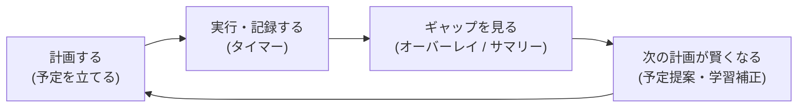
```mermaid
flowchart LR
    A["計画する<br/>(予定を立てる)"] --> B["実行・記録する<br/>(タイマー)"]
    B --> C["ギャップを見る<br/>(オーバーレイ / サマリー)"]
    C --> D["次の計画が賢くなる<br/>(予定提案・学習補正)"]
    D --> A
```

このループの各段階が、そのまま実装の主要領域に対応する:

| 段階 | 主な実装 | 章 |
|---|---|---|
| 計画する | アプリ内予定 / 定期予定(`lib/calendar/`) | §7.3 |
| 記録する | タイマー(`lib/timer/`) | §7.1 |
| ギャップを見る | オーバーレイ(`components/calendar-view.tsx`)/ サマリー(`lib/summary/`) | §9, §10 |
| 賢くなる | 予定提案(`suggestions.ts`)/ 学習補正(`rule-learning.ts`) | §7.4, §7.5 |

### 重要な前提: Google連携は現在「凍結中」

もともとGoogleカレンダー連携を主導線として設計されたが、ドメイン取得・OAuth審査のリードタイムが
開発ボトルネックになったため、2段階の方針転換を行った
(経緯は要件定義書 §変更履歴、仕様書 [P1-3](specs/P1-3_メール認証とGoogle任意連携.md) / [P2-5](specs/P2-5_アプリ内予定とGoogle連携凍結.md)):

1. **メール認証(Supabase Auth)を主導線化** — Googleログインは提供しない
2. **Google連携UIを環境フラグ `GOOGLE_INTEGRATION_ENABLED`(既定OFF)で凍結** — 予定はアプリ内作成で完結

Google連携のコード・テストは削除されておらず、フラグをONにすれば復活する
(判定は `lib/google/integration-flag.ts` の1関数に集約されている)。
**現在の主導線は「メール認証 + アプリ内予定 + タイマー」**である。
この資料でもGoogle連携のフローを解説するが、動作させるにはフラグONが必要。

---

## 2. 技術スタック

| レイヤー | 技術 | 補足 |
|---|---|---|
| フレームワーク | Next.js 16.2.10(App Router)+ React 19.2.4 + TypeScript strict | **Next.js 16 では middleware が `proxy.ts` に改名されている**。API差分は `node_modules/next/dist/docs/` を参照(`AGENTS.md` の指示) |
| 認証・DB | Supabase(Auth / Postgres / RLS) | `@supabase/ssr` + `@supabase/supabase-js` |
| スタイリング | Tailwind CSS v4 | デザイントークンを `@theme` で一元管理(`app/globals.css`)。raw color 禁止(静的テストで強制) |
| アイコン | lucide-react | `optimizePackageImports` 対象(§11) |
| 日時処理 | date-fns 4 + `@date-fns/tz` | `Date` の直接演算は避ける。DB保存は常にUTC(§8) |
| 外部API | Google Calendar API | `calendar.events.readonly` のみ。**writeスコープ禁止** |
| ホスティング | Vercel | 本番: https://plandiff.vercel.app |
| テスト | Vitest 4 + Testing Library | unit/component(jsdom)と integration(ローカルSupabase)の2層(§13) |
| 配布 | PWA | manifest + アイコンのみ。Service Worker / プッシュ通知はスコープ外 |

`next.config.ts` の設定は `optimizePackageImports: ["date-fns", "lucide-react"]` の1項目のみ。
理由は §11 を参照。

---

## 3. ローカル環境の立ち上げ

### 前提

- Node.js 22(CIと揃える。`.github/workflows/ci.yml` 参照)
- Docker(ローカルSupabaseの実行に必要)
- Supabase CLI(`npx supabase` で都度実行するため個別インストールは不要)

### 手順

```bash
# 1. 依存関係
npm ci

# 2. Gitフックを有効化する(これを忘れると品質ゲートが効かない)
git config core.hooksPath .githooks

# 3. 環境変数
cp .env.example .env.local
#    → 値を埋める(下表参照)

# 4. ローカルSupabaseを起動し、マイグレーションを適用する
npx supabase start
npx supabase db reset   # supabase/migrations/*.sql を頭から適用し直す

# 5. 開発サーバー
npm run dev             # http://localhost:3000
```

### 環境変数(`.env.example`)

| 変数 | 用途 | 入手元 |
|---|---|---|
| `NEXT_PUBLIC_SUPABASE_URL` | Supabaseのエンドポイント | `npx supabase status`(ローカル)/ ダッシュボード > Settings > API(本番) |
| `NEXT_PUBLIC_SUPABASE_ANON_KEY` | 匿名キー。RLS前提でクライアントに露出してよい | 同上 |
| `SUPABASE_SERVICE_ROLE_KEY` | **service role キー。RLSを迂回する**。`NEXT_PUBLIC_` を付けない | 同上 |
| `GOOGLE_CLIENT_ID` / `GOOGLE_CLIENT_SECRET` | Google OAuth。**凍結中は未設定でよい** | Google Cloud Console |
| `SUPABASE_DB_URL` | 結合テストがRLSを介さずDBを直接検証するために使う | `npx supabase status`。ローカルの既定値は `.env.example` に記載済み |
| `GOOGLE_INTEGRATION_ENABLED` | `"true"` のときだけGoogle連携UI/APIが有効(§1) | 手動。**既定は未設定=凍結** |

### 動作確認

```bash
npm test                  # unit/component(125ファイル・761件)
npm run test:integration  # 結合(23ファイル・133件。ローカルSupabase起動が前提)
npm run check             # typecheck + lint + test + build。完了報告前に必ず
```

初回は `npm test` が全件通ることを確認しておくと、以後の変更で何が壊れたか切り分けられる。

---

## 4. 全体アーキテクチャ

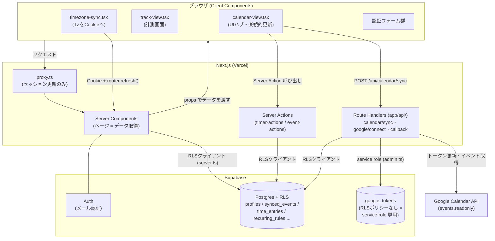
```mermaid
flowchart TB
    subgraph Browser["ブラウザ (Client Components)"]
        CV["calendar-view.tsx<br/>(UIハブ・楽観的更新)"]
        TV["track-view.tsx<br/>(計測画面)"]
        TZ["timezone-sync.tsx<br/>(TZをCookieへ)"]
        Forms["認証フォーム群"]
    end

    subgraph NextJS["Next.js (Vercel)"]
        Proxy["proxy.ts<br/>(セッション更新のみ)"]
        SC["Server Components<br/>(ページ = データ取得)"]
        SA["Server Actions<br/>(timer-actions / event-actions)"]
        RH["Route Handlers (app/api/)<br/>calendar/sync・google/connect・callback"]
    end

    subgraph Supabase["Supabase"]
        Auth["Auth<br/>(メール認証)"]
        PG[("Postgres + RLS<br/>profiles / synced_events /<br/>time_entries / recurring_rules ...")]
        Tokens[("google_tokens<br/>(RLSポリシーなし =<br/>service role 専用)")]
    end

    Google["Google Calendar API<br/>(events.readonly)"]

    Browser -->|"リクエスト"| Proxy
    Proxy --> SC
    CV -->|"Server Action 呼び出し"| SA
    CV -->|"POST /api/calendar/sync"| RH
    TZ -->|"Cookie + router.refresh()"| SC
    SC -->|"props でデータを渡す"| Browser
    SC -->|"RLSクライアント (server.ts)"| PG
    SA -->|"RLSクライアント"| PG
    RH -->|"RLSクライアント"| PG
    RH -->|"service role (admin.ts)"| Tokens
    RH -->|"トークン更新・イベント取得"| Google
    SC --- Auth
```

### 3つのSupabaseクライアント(`lib/supabase/`)

| ファイル | 用途 | 権限 |
|---|---|---|
| `server.ts` | Server Component / Server Action / Route Handler | ログインユーザーの権限(**RLSが効く**)。cookieからセッションを読む |
| `browser.ts` | Client Component | 同上(anonキー) |
| `admin.ts` | サーバー専用の特権処理 | **service role(RLSを迂回)**。`google_tokens` の読み書き、アカウント削除、pro-interest計測に限定。冒頭の `import "server-only"` により、誤ってクライアントバンドルに混入するとビルドエラーになる |

補助モジュール:

- **`session-user.ts`** — `auth.getUser()` の重複往復を抑えるヘルパー(P6-1)。
  `getUser()` は毎回HTTP往復でローカルキャッシュを持たないため、`WeakMap<SupabaseClient, Promise<User>>`
  でクライアントインスタンス単位に結果を保持する。**Reactの `cache()` を使っていない**のは、
  リクエストコンテキスト外(vitest)では素通しになり重複排除をテストで固定できないため
- **`paged-fetch.ts`** — PostgREST の行数上限(`max_rows`、既定1000)対策のページング取得(P6-0)。
  詳細は §11

### 責務の分離原則

- **Server Components がデフォルト**。ページ(Server Component)がDBからデータを取得し、
  propsでClient Componentに渡す。`"use client"` はインタラクションが必要な葉に限定
  (実際にはカレンダー・タイマー等のUIがほぼすべてクライアント側だが、**データ取得の起点は常にサーバー**)
- **Google APIの呼び出しはサーバーのみ**(`app/api/calendar/sync` に集約)。
  Googleのトークンは絶対にクライアントへ渡さない・ログに出さない
- `proxy.ts`(旧middleware)は**セッションの期限切れ更新のみ**を行い、認可判定はしない。
  未ログインのリダイレクトは `app/(app)/layout.tsx` が担当。
  マーケティングの静的ページ(`/`, `/pricing`, `/privacy`, `/terms`)は matcher から除外されている
  — 除外しないとLPを開くたびにSupabase Authへの往復が1回入る(P6-1)

---

## 5. 画面構成とルーティング

`app/` は3つのRoute Groupに分かれる。

```
app/
├── (marketing)/    # 未ログインでも見られる公開ページ
│   ├── page.tsx            # LP「見積もりが、当たるようになる。」
│   ├── pricing/            # 料金(Free / Pro近日公開)
│   ├── privacy/ terms/     # 規約類
│   └── login/ signup/ forgot-password/ reset-password/
├── (app)/          # 認証必須の本体。layout.tsx が未ログインを /login へリダイレクト
│   ├── calendar/           # ★中心画面: 予定×実績オーバーレイ
│   ├── track/              # 計測画面(カレンダーを経由しないタイマー操作)
│   ├── summary/            # ギャップサマリー(?range=today|week|month|custom)
│   ├── onboarding/         # 初回3ステップ(onboarded_at が NULL ならリダイレクト)
│   └── settings/           # ログアウト・データ全削除・テーマ・(Google連携)
├── api/            # Route Handlers
│   ├── calendar/sync/      # POST: Google同期(凍結中は404)
│   ├── google/connect/ google/callback/  # 独自OAuth2フロー(凍結中は404)
│   └── pro-interest/       # POST: 料金ページのクリック計測(認証不要)
└── auth/confirm/ auth/confirm-recovery/  # メール確認・パスワードリセットのトークン検証
```

### 認証済みシェル(`app/(app)/layout.tsx`)

わずか41行だが、押さえるべき点が3つある:

1. `export const dynamic = "force-dynamic"` — `cookies()` を呼ぶ前に環境変数チェックで例外を投げると
   Next.js の動的判定より先にビルド時プリレンダリングが走ってしまうため、明示している
2. `getSessionUser()` が `null` なら `/login` へリダイレクト — **認可判定はここが唯一の場所**
3. `<TimezoneSync />` を1つだけ配置 — 訪問者のTZをCookieへ同期する(§8)

レイアウトは `h-dvh` で固定し、コンテンツ領域を内部スクロールにしている。
これによりカレンダーのタイムラインが残り高さいっぱいに広がる(D-1d)。

### 画面遷移の全体像

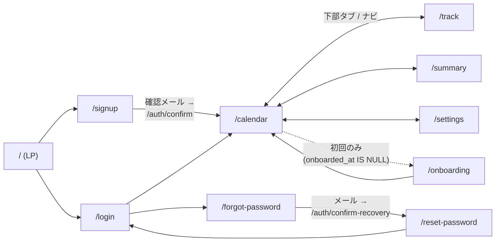
```mermaid
flowchart LR
    LP["/ (LP)"] --> Signup["/signup"]
    LP --> Login["/login"]
    Signup -->|"確認メール →<br/>/auth/confirm"| Calendar
    Login --> Calendar["/calendar"]
    Login --> Forgot["/forgot-password"]
    Forgot -->|"メール →<br/>/auth/confirm-recovery"| Reset["/reset-password"]
    Reset --> Login
    Calendar <-->|"下部タブ / ナビ"| Track["/track"]
    Calendar <--> Summary["/summary"]
    Calendar <--> Settings["/settings"]
    Calendar -.->|"初回のみ<br/>(onboarded_at IS NULL)"| Onboarding["/onboarding"]
    Onboarding --> Calendar
```

### Server Actions(各ページディレクトリに併置)

| ファイル | 主な関数 |
|---|---|
| `app/(app)/calendar/timer-actions.ts` | タイマー開始/停止/実績の更新・削除/実行中の開始時刻変更 |
| `app/(app)/calendar/event-actions.ts` | アプリ内予定CRUD + 繰り返しルールCRUD |
| `app/(app)/settings/actions.ts` | Google連携解除・アカウント削除 |
| `app/(app)/onboarding/actions.ts` | オンボーディング完了 |
| `app/(app)/actions.ts` | ログアウト |

### 表示状態はURLで持つ

カレンダーは `?view=day|week&date=yyyy-MM-dd`、サマリーは `?range=...&date=...`(customは `&from&to`)。
Reactのstateではなく**URLが表示状態の正**なので、リロード・共有・戻るボタンが自然に動く。
パースは `lib/calendar/view-date.ts` / `lib/summary/range.ts` の純粋関数に閉じている。

---

## 6. データモデル

マイグレーションは `supabase/migrations/` で管理(**ダッシュボード直編集は禁止**)。現在9ファイル。
全テーブルでRLS有効。

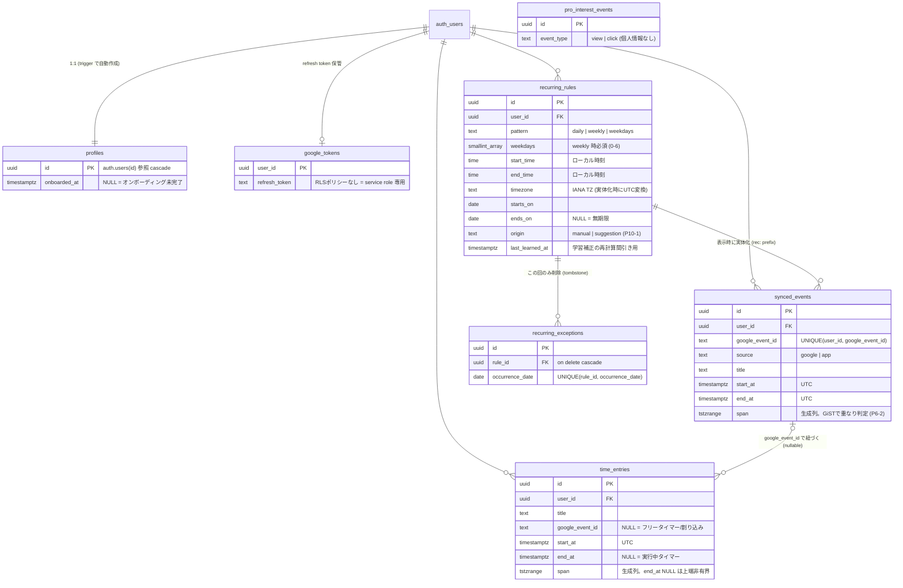
```mermaid
erDiagram
    auth_users ||--|| profiles : "1:1 (trigger で自動作成)"
    auth_users ||--o| google_tokens : "refresh token 保管"
    auth_users ||--o{ synced_events : ""
    auth_users ||--o{ time_entries : ""
    auth_users ||--o{ recurring_rules : ""
    synced_events |o--o{ time_entries : "google_event_id で紐づく (nullable)"
    recurring_rules ||--o{ recurring_exceptions : "この回のみ削除 (tombstone)"
    recurring_rules ||--o{ synced_events : "表示時に実体化 (rec: prefix)"

    profiles {
        uuid id PK "auth.users(id) 参照 cascade"
        timestamptz onboarded_at "NULL = オンボーディング未完了"
    }
    google_tokens {
        uuid user_id PK
        text refresh_token "RLSポリシーなし = service role 専用"
    }
    synced_events {
        uuid id PK
        uuid user_id FK
        text google_event_id "UNIQUE(user_id, google_event_id)"
        text source "google | app"
        text title
        timestamptz start_at "UTC"
        timestamptz end_at "UTC"
        tstzrange span "生成列。GiSTで重なり判定 (P6-2)"
    }
    time_entries {
        uuid id PK
        uuid user_id FK
        text title
        text google_event_id "NULL = フリータイマー/割り込み"
        timestamptz start_at "UTC"
        timestamptz end_at "NULL = 実行中タイマー"
        tstzrange span "生成列。end_at NULL は上端非有界"
    }
    recurring_rules {
        uuid id PK
        uuid user_id FK
        text pattern "daily | weekly | weekdays"
        smallint_array weekdays "weekly 時必須 (0-6)"
        time start_time "ローカル時刻"
        time end_time "ローカル時刻"
        text timezone "IANA TZ (実体化時にUTC変換)"
        date starts_on
        date ends_on "NULL = 無期限"
        text origin "manual | suggestion (P10-1)"
        timestamptz last_learned_at "学習補正の再計算間引き用"
    }
    recurring_exceptions {
        uuid id PK
        uuid rule_id FK "on delete cascade"
        date occurrence_date "UNIQUE(rule_id, occurrence_date)"
    }
    pro_interest_events {
        uuid id PK
        text event_type "view | click (個人情報なし)"
    }
```

### マイグレーション一覧

| ファイル | 内容 |
|---|---|
| `20260705022502_core_schema.sql` | 4テーブル + RLS + トリガ + 制約の**基本パターン**([P0-6](specs/P0-6_DBスキーマとRLS.md)) |
| `20260710070000_synced_events_source.sql` | `source` 列(アプリ内予定の区別) |
| `20260711011313_profiles_onboarded_at.sql` | `onboarded_at` |
| `20260713035812_pro_interest_events.sql` | Pro興味クリックの計測 |
| `20260713220814_recurring_events.sql` | `recurring_rules` / `recurring_exceptions`([P5-1](specs/P5-1_定期予定.md)) |
| `20260807143501_range_index_and_policy_roles.sql` | `span` 生成列 + GiST、ポリシーへの `to authenticated`([P6-2](specs/P6-2_データ増に耐えるクエリとインデックス.md)) |
| `20260808024737_revoke_anon_table_grants.sql` | `anon` 権限剥奪・既定権限の停止([P6-5](specs/P6-5_anon権限の剥奪.md)) |
| `20260808050650_revoke_routine_default_privileges.sql` | 上記の追補(ROUTINES の既定権限) |
| `20260813073430_recurring_rules_origin_and_learning.sql` | `origin` / `last_learned_at`([P10-1](specs/P10-1_提案経由予定の学習補正.md)) |

### 初見で押さえるべき3ポイント

**(1) `synced_events` には3種類の「予定」が同居する**

| 種別 | `source` | `google_event_id` の形式 | 作られ方 |
|---|---|---|---|
| Googleカレンダー予定 | `google` | GoogleのイベントID | `/api/calendar/sync` が upsert(凍結中は作られない) |
| アプリ内予定 | `app` | `app:<uuid>` | 予定作成パネルから `event-actions.ts` 経由で insert |
| 定期予定インスタンス | `app` | `rec:<ruleId>:<date>` | ページ表示時に `recurring_rules` からオンデマンドで冪等実体化(§7.3) |

この設計により、タイマー・オーバーレイ・サマリーは「`synced_events` にある行 = 予定」とだけ考えればよく、
予定の出自を意識せずに動く。Google由来の予定は読み取り専用(`source` ガードで改変不可)、
同期時のstale削除も `source='google'` の行だけが対象なのでアプリ内予定は消えない。

> **将来の設計課題**: `rec:<ruleId>:<date>` の文字列パースをやめて
> `synced_events.recurring_rule_id` 列に正規化するのが本命だが、既存データの移行を伴うため見送り中
> (`docs/開発計画.md` Phase 6 スコープ外に記録)。

**(2) 予定と実績は `time_entries.google_event_id` で紐づく**

- 予定ブロックからタイマーを開始すると、その予定の `google_event_id` を持つ実績ができる
  → オーバーレイで横並びに表示され、ズレ(遅れ・超過)が計算できる
- `google_event_id IS NULL` の実績 = フリータイマー / 割り込み作業(オーバーレイでは柿色+「フリー」ラベル)

**(3) 「実行中タイマーは常に1本」はDBが保証する**

- `end_at IS NULL` の行 = 実行中タイマー
- partial unique index `one_running_timer_per_user`(`(user_id) WHERE end_at IS NULL`)により、
  アプリ側のバグや複数デバイスの競合があっても2本目は挿入できない。
  アプリ側チェックはUXのためで、**最終防衛線はDB制約**

### RLSの規約(詳細は [P0-6](specs/P0-6_DBスキーマとRLS.md)、`db-migration` Skill)

- 全テーブルRLS有効。ポリシーは `user_id = (select auth.uid())` の own 4種(select/insert/update/delete)が基本形。
  **`to authenticated` を明示する**(P6-2)— 未認証リクエストでポリシー評価自体をスキップできる
- **`google_tokens` と `pro_interest_events` はRLS有効だがポリシーを一切作らない**
  = anon/authenticated からは何もできず、service role のみアクセス可能
- ヘルパー関数(`handle_new_user`, `set_updated_at`)は `private` スキーマに
  `SECURITY DEFINER` + `set search_path = ''` で作成
- **テーブルを追加したら `authenticated` への `grant` をマイグレーションに明示する**(P6-5)。
  既定権限を止めたため自動では付かない。付け忘れるとPostgRESTから権限エラーになる

**三重防御**: RLS有効 + ポリシーゼロ/最小 + GRANT最小化。どれか1つが破れても他が止める。

---

## 7. 主要データフロー

### 7.1 タイマー開始/停止(楽観的更新 + DB制約)

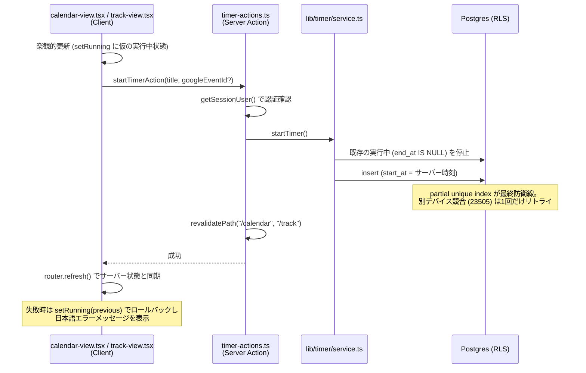
```mermaid
sequenceDiagram
    participant UI as calendar-view.tsx / track-view.tsx<br/>(Client)
    participant SA as timer-actions.ts<br/>(Server Action)
    participant SVC as lib/timer/service.ts
    participant DB as Postgres (RLS)

    UI->>UI: 楽観的更新 (setRunning に仮の実行中状態)
    UI->>SA: startTimerAction(title, googleEventId?)
    SA->>SA: getSessionUser() で認証確認
    SA->>SVC: startTimer()
    SVC->>DB: 既存の実行中 (end_at IS NULL) を停止
    SVC->>DB: insert (start_at = サーバー時刻)
    Note over DB: partial unique index が最終防衛線。<br/>別デバイス競合 (23505) は1回だけリトライ
    SA->>SA: revalidatePath("/calendar", "/track")
    SA-->>UI: 成功
    UI->>UI: router.refresh() でサーバー状態と同期
    Note over UI: 失敗時は setRunning(previous) でロールバックし<br/>日本語エラーメッセージを表示
```

ポイント:

- **時刻は常にサーバーが決める**(クライアントの時計を信用しない)
- 別タイマー実行中に別の予定をタップしたら、**エラーにせず既存を自動停止して新規開始**
- 停止は冪等(すでに止まっていても正常終了)
- 実行中エントリの編集・削除は不可。`updateTimeEntry` / `deleteTimeEntry` は
  `.not("end_at", "is", null)` ガードで確定済みのみを対象にする
  (実行中は開始時刻変更 `updateRunningStart` のみ可)
- 経過時間表示(1秒更新)はクライアント側の `lib/timer/use-now-seconds.ts` が担当。
  ポーリングはせず、リロードや複数デバイスでもDBの実行中行から復元される

### 7.2 Googleカレンダー同期(凍結中。フラグONで動作)

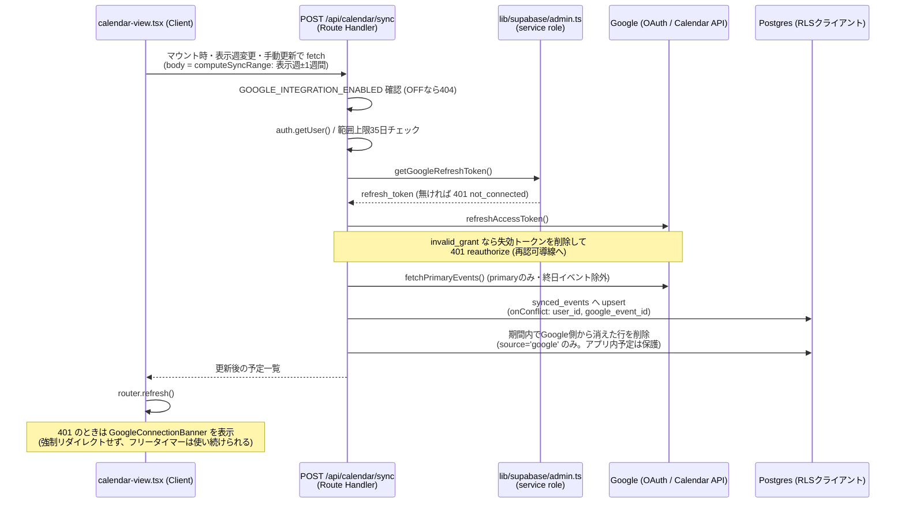
```mermaid
sequenceDiagram
    participant CV as calendar-view.tsx (Client)
    participant RH as POST /api/calendar/sync<br/>(Route Handler)
    participant Admin as lib/supabase/admin.ts<br/>(service role)
    participant G as Google (OAuth / Calendar API)
    participant DB as Postgres (RLSクライアント)

    CV->>RH: マウント時・表示週変更・手動更新で fetch<br/>(body = computeSyncRange: 表示週±1週間)
    RH->>RH: GOOGLE_INTEGRATION_ENABLED 確認 (OFFなら404)
    RH->>RH: auth.getUser() / 範囲上限35日チェック
    RH->>Admin: getGoogleRefreshToken()
    Admin-->>RH: refresh_token (無ければ 401 not_connected)
    RH->>G: refreshAccessToken()
    Note over RH,G: invalid_grant なら失効トークンを削除して<br/>401 reauthorize (再認可導線へ)
    RH->>G: fetchPrimaryEvents() (primaryのみ・終日イベント除外)
    RH->>DB: synced_events へ upsert<br/>(onConflict: user_id, google_event_id)
    RH->>DB: 期間内でGoogle側から消えた行を削除<br/>(source='google' のみ。アプリ内予定は保護)
    RH-->>CV: 更新後の予定一覧
    CV->>CV: router.refresh()
    Note over CV: 401 のときは GoogleConnectionBanner を表示<br/>(強制リダイレクトせず、フリータイマーは使い続けられる)
```

ポイント:

- 同期は**オンデマンドのみ**(webhook / push channel なし)。
  UXは「キャッシュ表示先行 → バックグラウンド同期 → 反映」
- **権限の使い分けが肝**: `google_tokens` の読み書きは service role、
  `synced_events` の読み書きは**ユーザー自身のRLSクライアント**。
  Google API呼び出しはこのRoute Handlerに集約されている
- Google連携の認可は Supabase Auth の `signInWithOAuth` を**使わない**独自OAuth2コードフロー
  (`/api/google/connect` → Google → `/api/google/callback`、state cookieでCSRF対策)。
  `signInWithOAuth` だとセッションが別アカウントに切り替わる危険があるため([P1-3](specs/P1-3_メール認証とGoogle任意連携.md))

### 7.3 定期予定のオンデマンド実体化

`recurring_rules` はルール(「毎週火木 9:00-10:00」等)だけを持ち、カレンダーに並ぶ実体は
**ページ表示のたびに `synced_events` へ冪等生成**される。

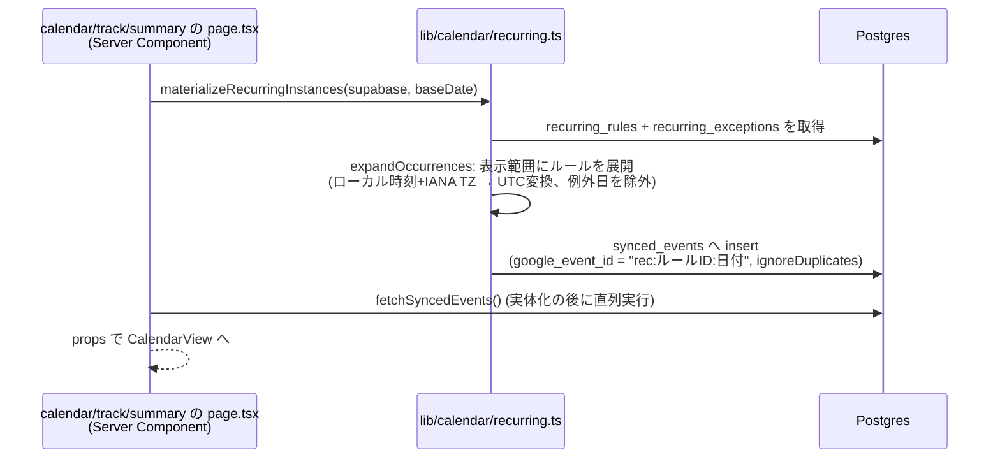
```mermaid
sequenceDiagram
    participant Page as calendar/track/summary の page.tsx<br/>(Server Component)
    participant Rec as lib/calendar/recurring.ts
    participant DB as Postgres

    Page->>Rec: materializeRecurringInstances(supabase, baseDate)
    Rec->>DB: recurring_rules + recurring_exceptions を取得
    Rec->>Rec: expandOccurrences: 表示範囲にルールを展開<br/>(ローカル時刻+IANA TZ → UTC変換、例外日を除外)
    Rec->>DB: synced_events へ insert<br/>(google_event_id = "rec:ルールID:日付", ignoreDuplicates)
    Page->>DB: fetchSyncedEvents() (実体化の後に直列実行)
    Page-->>Page: props で CalendarView へ
```

この設計の狙い: 実体化さえ済めば、**タイマー・オーバーレイ・サマリーの既存ロジックは
一切変更せずに定期予定へ対応できる**。「この回のみ削除」は `recurring_exceptions` に tombstone を積み、
「繰り返し全体の削除」でも過去のインスタンスは残す(計画した事実を保持する)。

### 7.4 実績からの予定提案([P5-2](specs/P5-2_実績からの予定提案.md) / [P5-7](specs/P5-7_平日毎日まとめ提案.md))

DBテーブルの追加なし。純粋関数 `computeSuggestions`(`lib/calendar/suggestions.ts`)で完結する:

1. ページが直近4週間の完了実績を取得し、propsで `plan-suggestions.tsx` へ
2. クライアントで「同タイトル × 同曜日 × 開始時刻差60分以内」のクラスタを検出(2日以上発生したもののみ)
3. 開始時刻・所要時間の**中央値**を15分単位に丸めて提案(最大3件)。
   既存予定・定期ルールと重複するもの、過去日時は除外
4. 受け入れは「この週に追加」(単発予定)/「毎週にする」(定期ルール化)
   — どちらも既存のServer Actionを再利用

### 7.5 提案経由の定期予定の学習補正([P10-1](specs/P10-1_提案経由予定の学習補正.md))

「毎週にする」で受け入れた定期予定(`origin='suggestion'`)を、**実績の中央値に合わせて自動調整**する。
P5-2 と同じ「中央値 → 15分丸め」の哲学を踏襲している。

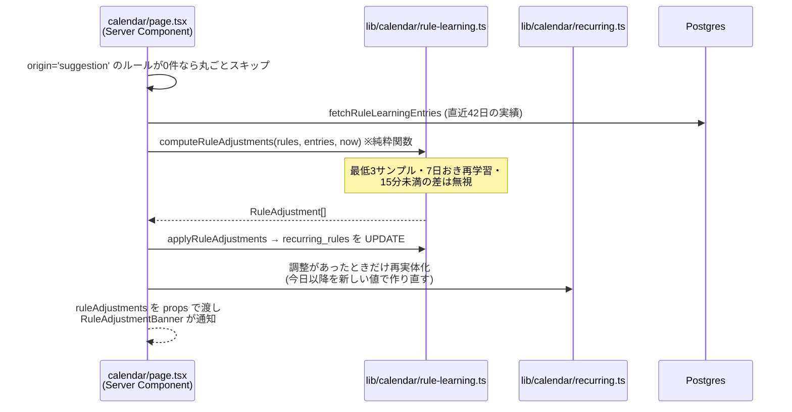
```mermaid
sequenceDiagram
    participant Page as calendar/page.tsx<br/>(Server Component)
    participant RL as lib/calendar/rule-learning.ts
    participant Rec as lib/calendar/recurring.ts
    participant DB as Postgres

    Page->>Page: origin='suggestion' のルールが0件なら丸ごとスキップ
    Page->>DB: fetchRuleLearningEntries (直近42日の実績)
    Page->>RL: computeRuleAdjustments(rules, entries, now)  ※純粋関数
    Note over RL: 最低3サンプル・7日おき再学習・<br/>15分未満の差は無視
    RL-->>Page: RuleAdjustment[]
    Page->>RL: applyRuleAdjustments → recurring_rules を UPDATE
    Page->>Rec: 調整があったときだけ再実体化<br/>(今日以降を新しい値で作り直す)
    Page-->>Page: ruleAdjustments を props で渡し<br/>RuleAdjustmentBanner が通知
```

**実装上の落とし穴が1つ**(`app/(app)/calendar/page.tsx:96-98` のコメント):
Next.js の fetch リクエストメモ化により、`recurring_rules` へ**同一レンダー内で同じSELECTを再度投げても
更新前の内容が返る**。そのため再実体化ではDBを読み直さず、既知のルール一覧に調整結果を
マージした値を明示的に渡している。

---

## 8. 時刻とタイムゾーンの扱い

**このプロジェクトで最も事故が起きやすい領域**。実装前に必ず読むこと。

### 大原則

1. **DBには常にUTCで保存し、表示時にユーザーのタイムゾーンへ変換する**
2. **`Date` の直接演算を避け、date-fns / `@date-fns/tz` を使う**
3. **開発機は JST、CI(GitHub Actions)は UTC** — ローカルで通ってもCIで落ちる

### 問題の構造: サーバーは訪問者のTZを知らない

Server Component は Vercel 上で **UTC** として動く。一方ブラウザはユーザーのTZ。
そのまま `new Date()` で「今日」を判定すると、サーバーとクライアントで日付がずれる。

これを解決するのが **TZ Cookie の往復**([P8-3](specs/P8-3_サマリーの日付またぎとTZ非対称の是正.md)):

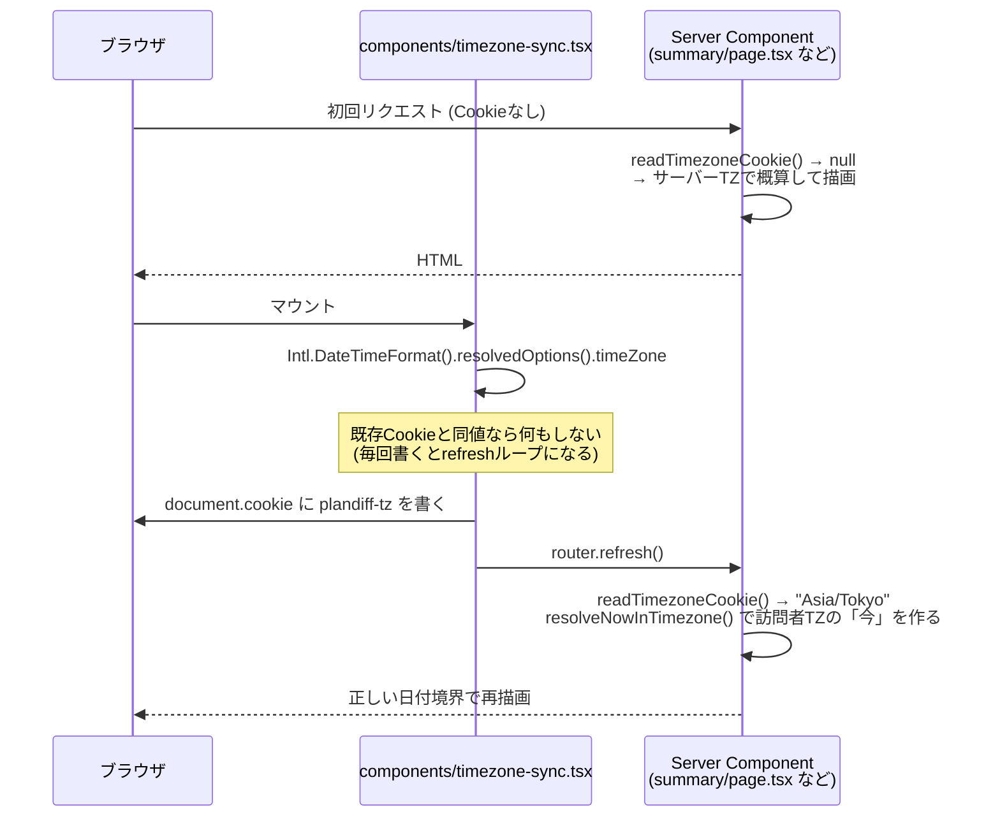
```mermaid
sequenceDiagram
    participant B as ブラウザ
    participant TS as components/timezone-sync.tsx
    participant SC as Server Component<br/>(summary/page.tsx など)

    B->>SC: 初回リクエスト (Cookieなし)
    SC->>SC: readTimezoneCookie() → null<br/>→ サーバーTZで概算して描画
    SC-->>B: HTML
    B->>TS: マウント
    TS->>TS: Intl.DateTimeFormat().resolvedOptions().timeZone
    Note over TS: 既存Cookieと同値なら何もしない<br/>(毎回書くとrefreshループになる)
    TS->>B: document.cookie に plandiff-tz を書く
    TS->>SC: router.refresh()
    SC->>SC: readTimezoneCookie() → "Asia/Tokyo"<br/>resolveNowInTimezone() で訪問者TZの「今」を作る
    SC-->>B: 正しい日付境界で再描画
```

関連ファイル:

| ファイル | 役割 |
|---|---|
| `lib/time/timezone-cookie.ts` | Cookie名と値の形式検証。**`next/headers` を持ち込まない**(クライアントからもimportするため) |
| `lib/time/timezone-cookie.server.ts` | Cookie読み取り(`next/headers` 依存のため分離) |
| `lib/time/now-in-timezone.ts` | `TZDate` で「訪問者TZでの現在時刻」を組み立てる。不正なTZ名は例外にせず base へフォールバック(不正Cookieでも SSR を落とさない) |
| `components/timezone-sync.tsx` | 上図のクライアント側。`app/(app)/layout.tsx` に1つだけ配置 |

### ハイドレーション不整合の回避

「今日」の判定や現在時刻線をSSRで描くとハイドレーションエラーになる。
そこで **`useSyncExternalStore` のサーバースナップショットを `null` にする**パターンを使う
(`lib/time/use-now-minute.ts`, `lib/timer/use-now-seconds.ts`)。
SSR時は `null` が返るので何も描画されず、ハイドレーション後にのみ時刻依存のUIが現れる。

### 日付またぎへの追従([P8-1](specs/P8-1_日付またぎの自動反映.md) 〜 P8-3)

`lib/time/use-now-minute.ts` が分単位の共有ストアを提供する。設計上の要点:

- **ストアはモジュールスコープに1つ**(購読コンポーネントごとにタイマーを張らない)
- **分境界にアラインした `setTimeout` 連鎖**で駆動する
  — 固定間隔の `setInterval` だと0時の検知が最大60秒遅れる
- `visibilitychange` / `focus` / `pageshow` でも再計算する
  — バックグラウンドタブのタイマースロットリングと、PWAのプロセスサスペンドからの復帰に対応
- 秒精度が要る実行中タイマーは `useNowSeconds` を使い続ける

### R-1: 日時テストはローカルTZで組み立て、`TZ=UTC` で確認する

**同じバグを3回出したためルール化された**(CLAUDE.md「バグ由来ルール」)。

- テストデータの日時は **`new Date(2026, 6, 7, 9, 0)` のようにローカルTZで構築する**。
  `"2026-08-03T00:00:00Z"` や `"+09:00"` 付きのISO文字列で固定しない
  (`startOfDay` はローカルTZで動くため、UTCとJSTで日の境界がずれる)
- 「今日」に依存するテストは基準時刻を固定する
  (`vi.useFakeTimers({ shouldAdvanceTime: true })` + `setSystemTime` で正午など)
- **日時が絡むテストを追加・変更したら、コミット前に `TZ=UTC npx vitest run <file>` を実行する**。
  境界値を触った場合は `TZ=Pacific/Kiritimati`(UTC+14)も確認すると西→東の両方向を潰せる
- pre-commit フックはローカルTZで走るため、この確認を代替しない

---

## 9. UIの核: オーバーレイ表示

予定と実績を左右のレーンに重ねる表示が**プロダクトの「顔」**であり、UI品質はここへ最優先で投資する
([P3-1](specs/P3-1_オーバーレイ表示.md) / [D-1-2](specs/D-1-2_デザイン刷新.md)、`ui-quality` Skill)。

```
時間軸        予定レーン (左55%)      実績レーン (右45%)
09:00 ─┬─  ┌─────────────────┐
       │    │ 設計レビュー      │ ▨▨ ← 開始遅延 (斜線ストライプ + 「+17分 遅れ」)
       │    │ (薄い塗り)        │ ┌────────────┐
10:00 ─┼─  └─────────────────┘  │ 設計レビュー │ ← 紐づき実績 (群青・濃い塗り)
       │                          │            │
       │                          └────────────┘ ▨▨ ← 超過分
11:00 ─┼─                        ┌────────────┐
       │                          │ 障害対応 ﹙フリー﹚│ ← 割り込み (柿色)
```

- **予定 = 左レーン55%・薄い塗り**(`bg-plan-fill`)。タップでタイマー開始/停止
- **実績 = 右レーン45%・濃い塗り**。予定に紐づく実績は群青(`bg-brand`)、
  フリー/割り込みは柿(`bg-interrupt`)+「フリー」ラベル
- ズレは開始遅延・超過を斜線ハッチ+符号付きdiff表記(「+17分 遅れ」)で表示。
  色だけに頼らず `aria-label` にも文言を入れる
- モバイルファースト: **すべてのUI変更は375px幅での確認が必須**

### コンポーネント構成

実装の中心は `components/calendar-view.tsx`(1613行)。内部構成:

```
CalendarView          … 状態管理・Server Action呼び出し・楽観的更新のハブ
├── WeekStrip         … 週表示の日ヘッダー(タップで選択日を切替。P11-1)
├── HourLines         … 方眼背景
└── DayColumn         … 1日分のオーバーレイ
    ├── PlanBlock     … 予定ブロック(左レーン)
    ├── ActualBlock   … 実績ブロック(右レーン)
    └── GapStripe     … ズレの斜線ハッチ
```

配置計算とズレ計算は純粋関数として切り出されている:

| モジュール | 関数 | 役割 |
|---|---|---|
| `lib/calendar/layout.ts` | `layoutDayEvents` / `hasEventOnDay` | ブロックの位置・高さ計算(`MIN_BLOCK_MINUTES = 24` で極小ブロックを潰さない) |
| `lib/timer/gap.ts` | `computeActualGaps` | 開始遅延・超過の算出 |

> **既知の課題**: `calendar-view.tsx` の分割は `docs/開発計画.md` に「Phase 6 スコープ外」として
> 記録されている。保守性の課題だが、性能への寄与はメモ化・遅延ロードでほぼ取り切れている。

### デザイントークンと raw color 禁止

色はすべて `app/globals.css` の CSS変数 → `@theme inline` 経由。コンポーネントに直書きしない。

```
--brand      群青 (実績・ブランド)      --plan-fill  群青10% (計画)
--interrupt  柿   (割り込み・ズレ)      --hatch      ズレの斜線
--paper      方眼紙(背景)             --grid       方眼(15分)
```

テーマ切替(D-1e)は `data-theme` 属性が最優先、属性なしはOS設定に追随。
**ダークのトークンは `@media (prefers-color-scheme: dark)` と `[data-theme="dark"]` の2箇所にあるため、
変更時は必ず両方を揃える**。

この規約は **テストで強制されている**: `tests/lib/design/no-raw-colors.test.ts` が
`app/**/*.tsx` と `components/**/*.tsx` を走査し、`bg-blue-500` のような直書きカラークラスと
`dark:` バリアントを検出したら失敗する。

### 即時フィードバック([P12-1](specs/P12-1_カレンダー操作の即時フィードバック.md))

`page.tsx` のサーバー往復が重いため、ナビゲーション操作で「クリックしても数秒反応しない」問題があった。
`useTransition` を1本(`viewPending`)導入し、共通ヘルパー `startViewUpdate` 経由で
`router.push` / `router.refresh` を12箇所ラップしている。

**設計上の要点**: `router.push` / `refresh` は `void` を返すため、素の `startTransition` では
`isPending` が即座に false へ戻る。`startTransition(async () => { await update() })` と
**非同期トランジションにすることで RSC 再取得のコミットまで pending を保てる**。

UI表現はナビ系ボタンの `disabled:opacity-50`、日付ラベル横の `Loader2` + `role="status"`、
グリッドの `aria-busy` + `pointer-events-none opacity-60`。
タイマー系(既に楽観的更新済み)は対象外。

---

## 10. サマリー画面

`/summary` はギャップを数値とグラフで振り返る画面。`?range=today|week|month|custom` で期間を切り替える
(customは `&from&to`)。積み上げの経緯は P3-2 → D-3 → P5-3 → P5-8 → P5-9 → P6-0 → P7-1 → P7-2。

### 集計とグラフの関係

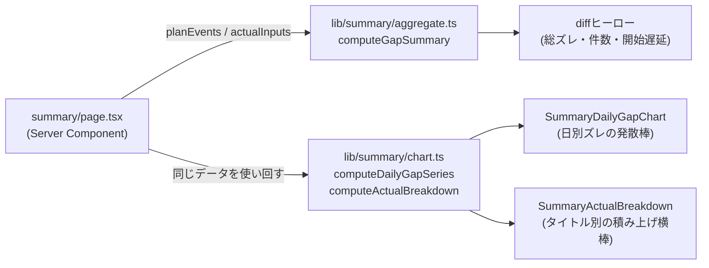
```mermaid
flowchart LR
    Page["summary/page.tsx<br/>(Server Component)"] -->|"planEvents / actualInputs"| Agg["lib/summary/aggregate.ts<br/>computeGapSummary"]
    Page -->|"同じデータを使い回す"| Chart["lib/summary/chart.ts<br/>computeDailyGapSeries<br/>computeActualBreakdown"]
    Agg --> Hero["diffヒーロー<br/>(総ズレ・件数・開始遅延)"]
    Chart --> G1["SummaryDailyGapChart<br/>(日別ズレの発散棒)"]
    Chart --> G2["SummaryActualBreakdown<br/>(タイトル別の積み上げ横棒)"]
```

**グラフはDBを追加で読まない**。`page.tsx` が取得済みの `planEvents` / `actualInputs` を使い回す
([P7-1](specs/P7-1_サマリーの日別ズレグラフ.md) / [P7-2](specs/P7-2_サマリーの時間内訳グラフ.md))。

### 守るべき不変条件

**集計規則は `computeGapSummary` と `computeDailyGapSeries` で完全に一致させる**
— 「開始時刻が期間内にあるものだけを、その開始日に全量計上する」。
これにより**グラフの系列の総和がヒーローの集計値と必ず一致する**。
この不変条件は `chart.ts` のテスト S10 で固定されている。

範囲をまたぐ予定・実績は集計対象外(仕様。[P3-2](specs/P3-2_ギャップサマリー.md))。

### 行数上限のバグと対策([P6-0](specs/P6-0_サマリー集計の行数上限.md))

PostgREST には1レスポンスあたりの行数上限(`max_rows`、Supabaseの既定は1000)があり、
**上限に達すると*エラーなく*打ち切られる**。`.limit()` を付けていないクエリでも同じで、
サマリーの長期間表示(最大366日)では集計値が黙って過小になっていた。

対策は `lib/supabase/paged-fetch.ts`:

- `.range()` でページを繰り返し取得して全件を組み立てる(`PAGE_SIZE = 1000`)
- **想定を超えたら部分結果を返さず `RowLimitExceededError` で明示的に失敗させる**
  (`MAX_FETCH_ROWS = 20000`)。黙って打ち切ることが本バグの原因だったため

「エラーを握りつぶさず、正しく失敗させる」というこのプロジェクトの姿勢が最もよく出ている実装。

---

## 11. 性能とセキュリティの設計判断

Phase 6(2026-08-06〜08)でまとめて対処した項目。「何が問題で、どう解いたか」で整理する。

| ID | 問題 | 解決 |
|---|---|---|
| [P6-0](specs/P6-0_サマリー集計の行数上限.md) | PostgREST の `max_rows` が**黙って**結果を打ち切り、集計値が過小になる | ページング取得 + 上限超過は例外(§10) |
| [P6-1](specs/P6-1_サーバー往復の集約.md) | `auth.getUser()` が layout / page / lib からそれぞれ呼ばれHTTP往復が積み上がる | `session-user.ts` で `WeakMap` キャッシュ。`proxy.ts` の matcher から静的LPを除外。`page.tsx` の独立クエリを `Promise.all` で並列化 |
| [P6-2](specs/P6-2_データ増に耐えるクエリとインデックス.md) | 重なり判定 `start_at < timeMax AND end_at > timeMin` は片側境界しかインデックスを使えず、1週間の表示に全履歴を読む(実測: 約11,000行で `Rows Removed by Filter: 10751`) | `tstzrange` の**生成列 `span`** + `btree_gist` による複合GiSTインデックス |
| [P6-3](specs/P6-3_クライアントバンドルとレンダリング.md) | 初回ロードJSが大きい / 毎レンダーの無駄な計算 | ①`date-fns/locale` の `ja` を曜日7語だけの最小localeへ置換(`lib/ui/ja-locale.ts`) ②`optimizePackageImports` ③`DayColumn` 内の重い計算(`layoutDayEvents` × 2、`computeActualGaps`)を `useMemo` 化 ④編集パネル群の `next/dynamic` 遅延ロード ⑤sticky バーの `backdrop-blur` 撤去。実測: First Load JS `/calendar` -3.8% / `/track` -5.7%、重複チャンク2本(71,599バイト)を解消 |
| [P6-5](specs/P6-5_anon権限の剥奪.md) | 本番の `anon` に `google_tokens` を含む全テーブルのDMLが付与されていた。`anon`/`authenticated` に **TRUNCATE**(RLS対象外)も | `anon` から全剥奪、`authenticated` は必要最小限へ付け直し、**既定権限そのものを停止** |

### P6-3 で意図的に見送ったもの

仕様書 3-D は最終ステップに `useCallback` + `React.memo` を計画していたが、**実装時に見送られた**。
理由は「依存の連鎖が `calendar-view.tsx` 全体に及び、stale closure のリスクが効果に見合わない」。
重い計算(`layoutDayEvents` × 2、`computeActualGaps`)は `DayColumn` 内の `useMemo` で既に止まっているため、
`React.memo` の追加分は限界効用が小さいと判断された。

同様に `now` の `useMemo` 固定も取りやめている
(現在時刻ラインがハイドレーション時刻で永久固定になるため)。代わりに `actualInputs` の基準時刻を
**分単位に丸めて参照を安定させる**方法を採った(`calendar-view.tsx:802-813`)。
この「分単位に丸める」発想が後に P8-1 の `use-now-minute.ts` へつながっている。

### P6-2 の `span` 生成列に潜む2つの罠

マイグレーションのコメントが秀逸なので、要点だけ引く:

```sql
case
  when start_at = end_at then tstzrange(start_at, end_at, '[]')  -- 罠1
  when start_at < end_at then tstzrange(start_at, end_at, '[)')
  else null                                                       -- 罠2
end
```

1. **`[x,x)` は空範囲で、何とも重ならない**。ゼロ長の行は作りうる(タイマーの即時停止、Google側の予定)ため、
   `case` がないとゼロ長の予定・実績が一覧から**黙って消える**
2. **生成列の評価は CHECK 制約より先に走る**。`end_at < start_at` を `tstzrange()` へ渡すと
   `data_exception`(22000)が上がり、本来の `check_violation`(23514)を覆い隠す。
   不正データの拒否は CHECK に任せ、生成列は `null` へ倒す

`time_entries` では `end_at IS NULL`(実行中)が `tstzrange(start_at, null, '[)')` = 上端非有界となり、
「まだ終わっていない」という意味とちょうど一致する。

### P6-5 が示す姿勢

発見時点で「どの経路からも悪用できない」ことは確認されていた
(RLSがポリシーゼロで全拒否、PostgRESTはTRUNCATE非公開、`anon` にDBログインなし)。
それでも直したのは、**防御が一段減っていることと、既定権限で新規テーブルにも自動付与されるため**。
この判断基準は今後も踏襲する。

### スコープ外として記録されている項目

`docs/開発計画.md` の「Phase 6 のスコープ外」に、見送った理由つきで記録されている
(認証4ページの `supabase-js` 削減、`calendar-view.tsx` の分割、`getClaims()` 移行、
サマリー集計のRPC化、`recurring_rule_id` の正規化)。
**同じ検討を繰り返さないため、着手前にここを読むこと。**

---

## 12. 初学者がつまずくポイント

1. **「Googleカレンダーと同期されない」— 仕様です(凍結中)**。
   `GOOGLE_INTEGRATION_ENABLED` が未設定/false のとき、同期API・連携UIはすべて404/非表示になる。
   ローカルで連携を試すにはフラグONとGoogle OAuthクレデンシャルが必要
2. **日時はすべてUTCでDB保存、表示時にユーザーTZへ変換**。§8 を必ず読む。
   過去に `TZDate` のコピーコンストラクタがTZを引き継がずCI(UTC環境)でだけ落ちるバグがあった
   (2026-07-15ログ)
3. **SSRとクライアントのTZ不一致**: サーバーはUTC、ブラウザはユーザーTZ。
   `useSyncExternalStore` のサーバースナップショットを `null` にしてハイドレーション後にのみ描画する(§8)
4. **`server-only` の import 規約**: サーバー専用モジュール(`lib/supabase/admin.ts`、`lib/google/token.ts`、
   `lib/calendar/rule-learning.ts`、`lib/supabase/paged-fetch.ts` 等)は冒頭で `import "server-only"`。
   クライアントからも使う純粋関数(`sync-range.ts`, `suggestions.ts`, `layout.ts`, `gap.ts`, `view-date.ts` 等)には**付けない**。
   テストでは `tests/stubs/server-only.ts` で空スタブ化している
5. **文言は `lib/**/messages.ts` に集約**(日本語)。UIテキストをコンポーネントにハードコードしない
6. **色をハードコードしない**。`tests/lib/design/no-raw-colors.test.ts` が失敗する(§9)
7. **Next.js の fetch メモ化**: 同一レンダー内で同じSELECTを再度投げても更新前の内容が返る。
   更新直後に読み直す設計にしない(§7.5 の実例)
8. **非同期トランジションのテストは未解決Promiseを残さない**。
   残すと次のテストを汚染する(P12-1 の実装時に判明)。各テスト末尾で `deferred.resolve()` する
9. **Next.js 16 は学習データと違う可能性がある**。`AGENTS.md` の指示どおり、
   `node_modules/next/dist/docs/` のガイドを読んでから書くこと(例: middleware → `proxy.ts`)

---

## 13. 開発ワークフローとテスト

### ディレクトリマップ

```
app/                  # ルーティング (§5)
components/           # UIコンポーネント (33ファイル。ほとんどが "use client")
lib/
  supabase/           # server / browser / admin の3クライアント + session-user / paged-fetch (§4)
  google/             # token (OAuth) / calendar (API) / sync-range / integration-flag
  calendar/           # events(読取) / layout(配置=純粋関数) / recurring(実体化) /
                      #   suggestions(提案) / rule-learning(学習補正) / view-date / app-events
  timer/              # service(コアロジック) / entries / gap(ズレ計算) / blocks / elapsed / use-now-seconds
  summary/            # aggregate(集計) / chart(グラフ) / format / range (§10)
  time/               # now-in-timezone / timezone-cookie / use-now-minute (§8)
  track/              # 計測画面ロジック (entry-groups / promotion / quick-start)
  theme/ ui/ auth/ onboarding/ errors/ pricing/ settings/ pwa/
supabase/migrations/  # スキーマ変更は必ずここ (9ファイル、§6)
docs/
  要件定義書.md        # プロダクト仕様の起点
  開発計画.md          # フェーズと進捗。着手項目は必ずここから選ぶ
  specs/              # 機能別仕様書 (実装前に作成し承認を得る)
  logs/               # 日次の行動履歴
  指示資料/            # ユーザーが指示のために置く資料。タスク着手時に必ず確認
tests/                # 対象と同じ構造でミラーリング
proxy.ts              # 旧middleware。セッション更新のみ
```

### 最初に読むべき6ファイル

| ファイル | 学べること |
|---|---|
| `app/(app)/calendar/page.tsx` | Server Component がデータ取得の起点であること、`Promise.all` による並列化(P6-1)、学習補正の呼び出し順序 |
| `components/calendar-view.tsx` | 状態管理・楽観的更新・`useTransition`・Server Action 呼び出しのハブ |
| `lib/timer/service.ts` | 楽観更新とDB制約(partial unique index)の連携、冪等な停止 |
| `lib/calendar/recurring.ts` | ルール → `synced_events` への冪等実体化。TZ変換の実例 |
| `app/api/calendar/sync/route.ts` | service role と RLSクライアントの権限分離の実例 |
| `supabase/migrations/20260705022502_core_schema.sql` | RLS・トリガ・制約の基本パターン |

### 開発の進め方(必須。詳細は CLAUDE.md と `spec-driven-dev` Skill)

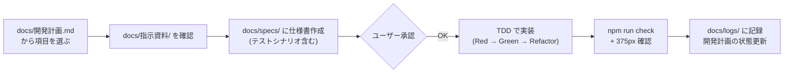
```mermaid
flowchart LR
    A["docs/開発計画.md<br/>から項目を選ぶ"] --> B["docs/指示資料/ を確認"]
    B --> C["docs/specs/ に仕様書作成<br/>(テストシナリオ含む)"]
    C --> D{"ユーザー承認"}
    D -->|OK| E["TDD で実装<br/>(Red → Green → Refactor)"]
    E --> F["npm run check<br/>+ 375px 確認"]
    F --> G["docs/logs/ に記録<br/>開発計画の状態更新"]
```

- **仕様書なし・ユーザー承認なしの実装は禁止**。
  テストの無効化(skip / コメントアウト / `--passWithNoTests`)による「全件通過」も禁止
- 完了の定義: `npm run check` 通過、テストシナリオとの対応、375px確認、ログ記録
- **mainへの直接コミット禁止**。フィーチャーブランチ + PR
- **同じバグを3回出したらルール化する**(CLAUDE.md「バグ由来ルール」。現在 R-1 の1件)

### 品質ゲートは2重

| ゲート | 実行内容 | 環境 |
|---|---|---|
| pre-commit(`.githooks/pre-commit`) | format:check → typecheck → lint → test → build | ローカル(**JST**) |
| CI(`.github/workflows/ci.yml`) | 同上(Node 22) | GitHub Actions(**UTC**) |

**この TZ の違いが R-1 の根拠**(§8)。pre-commit はローカルTZで走るため、
UTC環境での確認を代替しない。緊急時に `--no-verify` を使ったら、理由を `docs/logs/` に残す。

### テストの2層構成

| 層 | 設定 | 環境 | 実行 | 規模 |
|---|---|---|---|---|
| unit / component | `vitest.config.ts` | jsdom | `npm test` | **125ファイル / 761件** |
| integration | `vitest.config.integration.ts` | node + **ローカルSupabase** | `npm run test:integration` | **23ファイル / 133件** |

- `tests/` はソースと同じ構造でミラーリング。
  カレンダーのcomponentテストは観点別に分割(`-overlay` / `-timer` / `-recurring` / `-week-select` 等)
- integrationは**共有DBを使うため直列実行**(`fileParallelism: false`)。
  並列だとテーブル全削除系のクリーンアップが他ファイルの行を消して不安定になる
- 両設定とも `server-only` を `tests/stubs/server-only.ts` で空スタブに差し替えている
- integrationは RLS・DB制約・GRANT 込みの検証
  (`timer-service` / `calendar-sync` / `recurring-events` / `table-grants` / `range-overlap` 等)

### よく使うコマンド

```bash
npm run dev               # 開発サーバー
npm test                  # unit/component テスト
npm run test:watch        # TDD中はこちら
npx vitest run path/to/file.test.ts   # 単一ファイル
TZ=UTC npx vitest run path/to/file.test.ts   # R-1 の確認
npm run test:integration  # 結合テスト (ローカルSupabase必須)
npm run check             # typecheck + lint + test + build (完了報告前に必ず)
npx supabase start        # ローカルSupabase起動
npx supabase db reset     # マイグレーションを頭から適用し直す
npx supabase db diff      # マイグレーション差分確認
```

---

## 14. やってはいけないこと

- Googleのトークン・APIキーをクライアントバンドル・ログ・エラーメッセージに含める
- RLSなしのテーブルを作る / `anon` キーで `google_tokens` にアクセスする
- **テーブルを追加して `authenticated` への `grant` を書き忘れる**(既定権限を止めているため自動では付かない)
- Google Calendar の **write スコープを追加するPRを出す**(OAuth審査要件が変わる。人間が判断する)
- カレンダーデータを表示・ギャップ分析以外の目的で保存・加工する(Google Limited Use 要件)。
  設定画面の「データ全削除」はこの要件への対応でもある
- マイグレーションを経ないスキーマ変更(Supabaseダッシュボードの直編集)
- MVPスコープ外(書き戻し、複数カレンダー、レポート出力、課金実装)を先回りで作る
- **テストの無効化・削除によってテストを「通す」**
